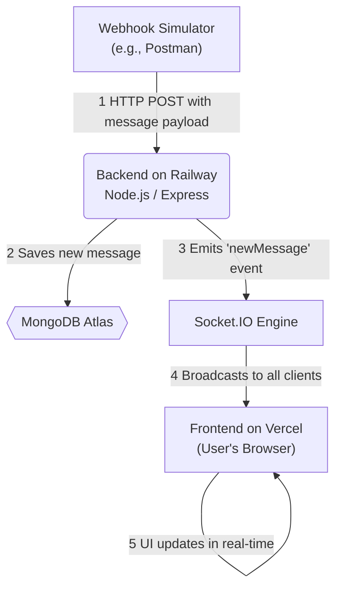
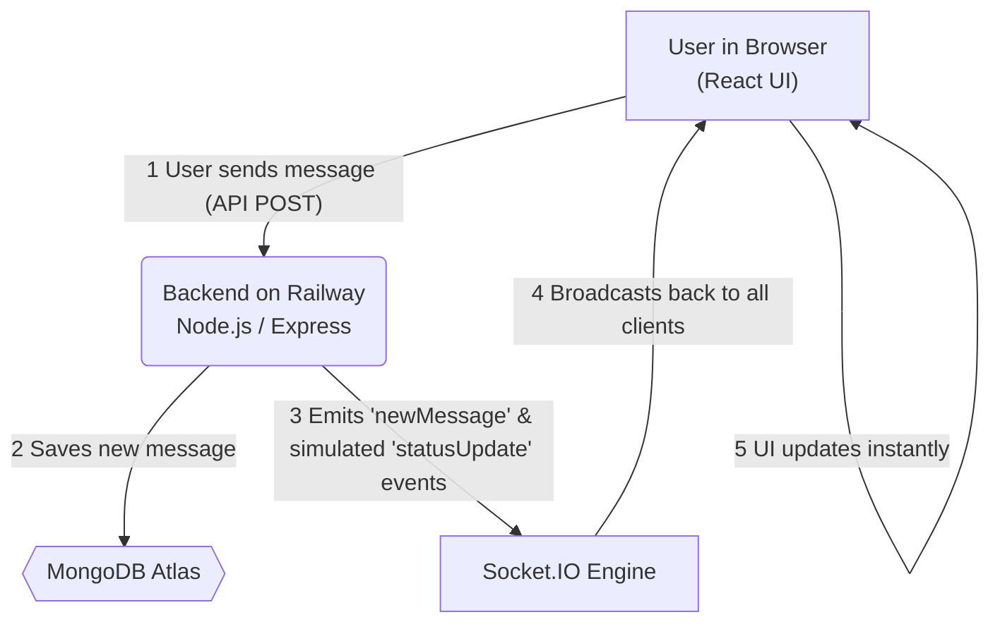

# WhatsApp Web Clone - A Real-Time Chat Interface


A full-stack web application that meticulously mimics the interface and real-time functionality of WhatsApp Web. It processes simulated webhook data, displays conversations in a clean and responsive UI, and supports sending messages with live status updates.

[](https://whatsapp-clone-three-zeta.vercel.app/) 

---

## ✨ Features

*   **WhatsApp Web Replica:** A clean, responsive, and familiar UI designed to be a close replica of the official WhatsApp Web client.
*   **Real-Time, Bidirectional Communication:** New messages and status updates appear instantly for all users without needing to refresh the page, powered by WebSockets (Socket.IO).
*   **Webhook Data Processing:** A robust backend service processes simulated webhook payloads for new messages and message statuses (`sent`, `delivered`, `read`).
*   **Live Sidebar Updates:** The conversation list updates in real-time, moving new chats to the top and updating the last message preview instantly.
*   **Message Status Simulation:** Messages sent from the UI receive simulated status updates (✓ for sent, ✓✓ for delivered, blue ✓✓ for read) to mimic the real user experience.
*   **Fully Responsive Design:** A mobile-first design that provides a seamless experience on both desktop and mobile devices, transitioning from a two-column to a single-view layout.
*   **Dark Mode:** Includes a fully functional, user-toggleable dark mode theme that persists across sessions.

---

## 🛠️ Tech Stack

### Frontend (Deployed on Vercel)
*   **Framework:** React (with Vite)
*   **Language:** TypeScript
*   **Styling:** Tailwind CSS v4 
*   **UI Components:** shadcn/ui
*   **Real-Time Client:** Socket.IO Client
*   **API Client:** Axios

### Backend (Deployed on Railway)
*   **Runtime:** Node.js
*   **Framework:** Express.js
*   **Language:** TypeScript
*   **Database:** MongoDB with Mongoose ODM
*   **Real-Time Server:** Socket.IO

---

## 🌐 Architecture & Data Flow

This project uses a decoupled frontend/backend architecture. The frontend is a static site hosted on Vercel's Edge Network for performance, while the backend is a stateful, long-running server hosted on Railway to maintain persistent WebSocket connections.

### Flow 1: Receiving a Message (Webhook)

This flowchart shows the steps when a new message is sent *to* the application from an external source.



### Flow 2: Sending a Message (from UI)

This flowchart shows the steps when a user sends a message *from* the application's interface.



---

## 🚀 Getting Started Locally

To run this project on your local machine, follow these steps.

### Prerequisites
*   Node.js (v18 or later recommended)
*   npm (or your preferred package manager)
*   A free MongoDB Atlas account for the database

### 1. Clone the Repository
```bash
git clone https://github.com/srobinb803/whatsapp-clone.git
cd whatsapp-clone
```

### 2. Backend Setup
```bash
# Navigate to the server directory
cd server

# Install dependencies
npm install

# Create a .env file in the /server directory
# and add your MongoDB connection string and client URL
```
**`server/.env` file:**
```env
MONGO_URI=your_mongodb_atlas_connection_string
CLIENT_URL=http://localhost:5173 # Or your Vite dev port
PORT=5000
```
```bash
# Start the backend development server
npm run dev
```
The backend will be running on `http://localhost:5000`.

### 3. Frontend Setup
```bash
# Navigate to the client directory from the root
cd client

# Install dependencies
npm install

# Create a .env file in the /client directory
# that points to your local backend server
```
**`client/.env` file:**

```env
VITE_API_URL=http://localhost:5000/api
VITE_SOCKET_URL=http://localhost:5000
```
```bash
# Start the frontend development server
npm run dev
```
The frontend will open in your browser, usually at `http://localhost:5173`.

### 4. Sending Webhook Data
Use an API client like Postman to send `POST` requests with the sample JSON payloads to the backend webhook endpoint:

`http://localhost:5000/api/webhook`

---

## ☁️ Deployment

This project is deployed using a split architecture:

*   The **frontend** is deployed as a static site on **Vercel**. The Root Directory in the Vercel project settings is set to `client`.
*   The **backend** is deployed as a long-running service on **Railway**. The Root Directory in the Railway project settings is set to `server`.

### Required Environment Variables

**For the Vercel Frontend:**
*   `VITE_API_URL`: The full public URL of your deployed Railway server (e.g., `https://my-server.up.railway.app`).
*   `VITE_SOCKET_URL`: The same URL as `VITE_API_URL`.

**For the Railway Backend:**
*   `MONGO_URI`: Your MongoDB Atlas connection string.
*   `CLIENT_URL`: The full public URL of your deployed Vercel frontend (e.g., `https://my-client.vercel.app`).